<table><thead><tr><th>  #  	</th><th>Label                                              	</th><th>Material              	</th><th>Dimensions</th></tr>
</thead><tbody><tr><td colspan="4"></td></tr>
<tr><th colspan="4">Holder</th></tr>
<tr><td> 14x </td><td>	Beam_Rectangle                                     	</td><td>-      	</td><td>[7.0cm x 1.7m x 7.0cm]</td></tr>
<tr><td>     	</td><td colspan="3">Cut from 6m or 12m metal beam.</td></tr>
<tr><td> 14x 	</td><td colspan="3">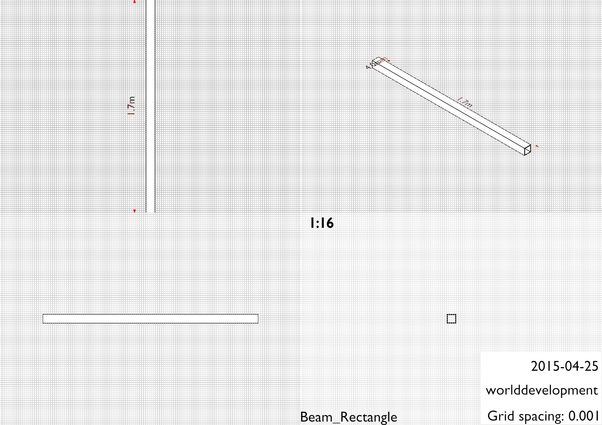</td></tr>
<tr><td colspan="4"></td></tr>
<tr><td>  9x </td><td>	Beam_Rectangle                                     	</td><td>-               	</td><td>[5.0cm x 1.7m x 5.0cm]</td></tr>
<tr><td>     	</td><td colspan="3">Cube</td></tr>
<tr><td>  9x 	</td><td colspan="3"></td></tr>
<tr><td colspan="4"></td></tr>
<tr><td>  2x </td><td>	Beam_cylindrical_bearing                           	</td><td>-                 	</td><td>[4.0cm x 4.0cm x 4.0cm]</td></tr>
<tr><td>     	</td><td colspan="3">EN10305-1, Precision steel pipe E235+C, seamless, 4mm thickness</td></tr>
<tr><td>  2x 	</td><td colspan="3">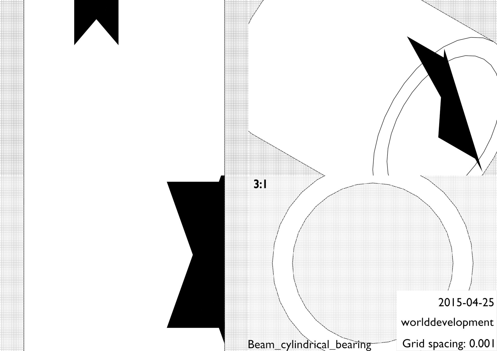</td></tr>
<tr><td colspan="4"></td></tr>
<tr><td>  1x </td><td>	Beam_cylindrical                                   	</td><td>-                  	</td><td>[3.0cm x 3.0cm x 1.4m]</td></tr>
<tr><td>     	</td><td colspan="3">EN10060/EN10025, Steel beam round, S235JR (235N/mm^2)</td></tr>
<tr><td>  1x 	</td><td colspan="3">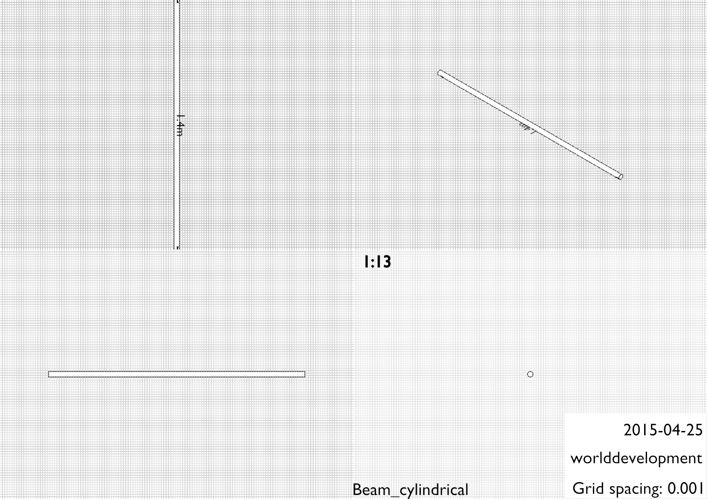</td></tr>
<tr><td colspan="4"></td></tr>
<tr><td>  2x </td><td>	Beam_U                                             	</td><td>-               	</td><td>[7.0cm x 1.7m x 7.0cm]</td></tr>
<tr><td>     	</td><td colspan="3">Cut from 6m metal beam.</td></tr>
<tr><td>  2x 	</td><td colspan="3">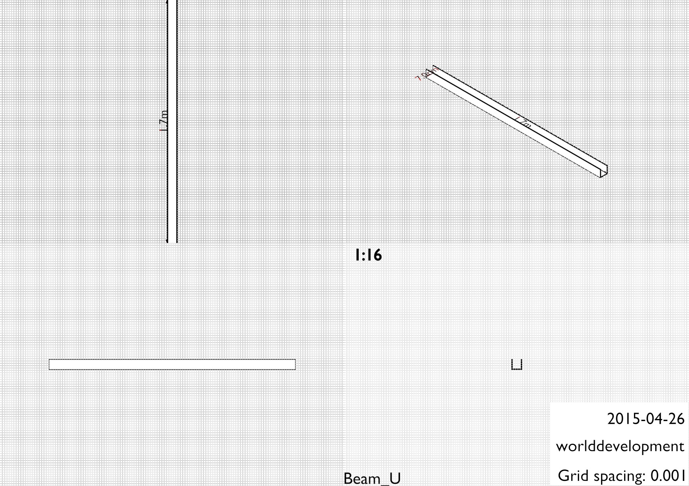</td></tr>
<tr><td colspan="4"></td></tr>

<tr><th colspan="4">Various</th></tr>
<tr><td>  1x </td><td>	Motor                                              	</td><td>-                 	</td><td>[20.389cm x 38.5cm x 20.389cm]</td></tr>
<tr><td>     	</td><td colspan="3">Choose as available, according to power capability of the waterwheel.</td></tr>
<tr><td>  1x 	</td><td colspan="3">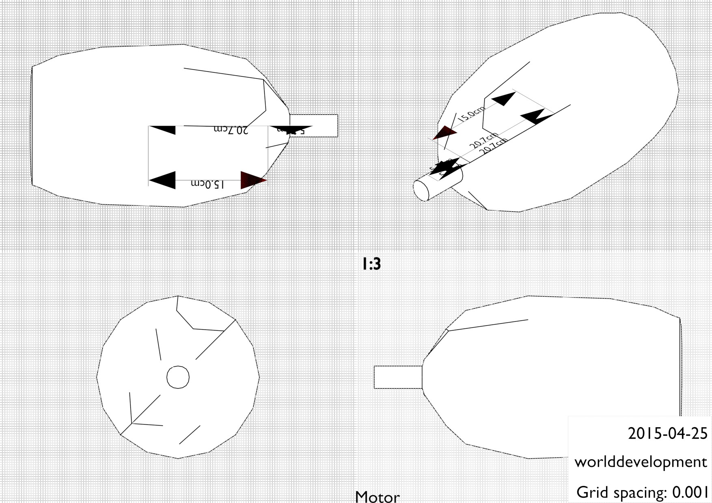</td></tr>
<tr><td colspan="4"></td></tr>
<tr><td>  2x </td><td>	Sheet_Motor_Mount                                  	</td><td>-	</td><td>[17.0cm x 23.0cm x 10.0mm]</td></tr>
<tr><td>     	</td><td colspan="3">(Included as reference for drilling the holes into the beams.)</td></tr>
<tr><td>  2x 	</td><td colspan="3">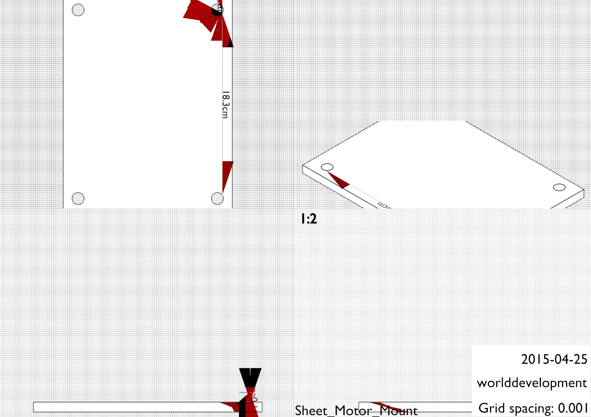</td></tr>
<tr><td colspan="4"></td></tr>
<tr><td> 16x </td><td>	Bolt                                               	</td><td>-        	</td><td>[2.194cm x 1.9cm x 6.842cm]</td></tr>
<tr><td>     	</td><td colspan="3">Bolt</td></tr>
<tr><td> 16x 	</td><td colspan="3">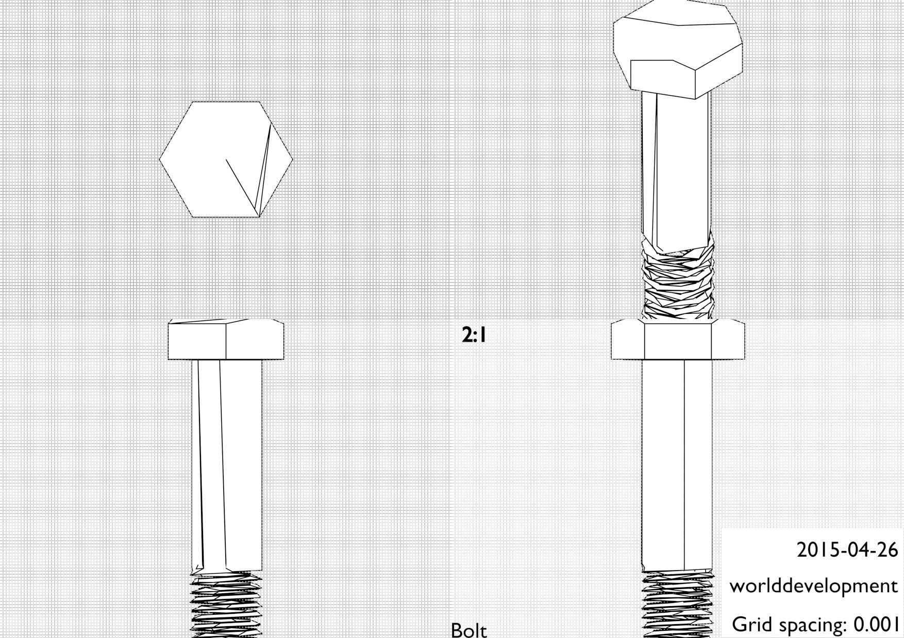</td></tr>
<tr><td colspan="4"></td></tr>
<tr><td>  8x </td><td>	Bolt                                               	</td><td>-        	</td><td>[2.194cm x 1.9cm x 11.392cm]</td></tr>
<tr><td>     	</td><td colspan="3">Bolt</td></tr>
<tr><td>  8x 	</td><td colspan="3">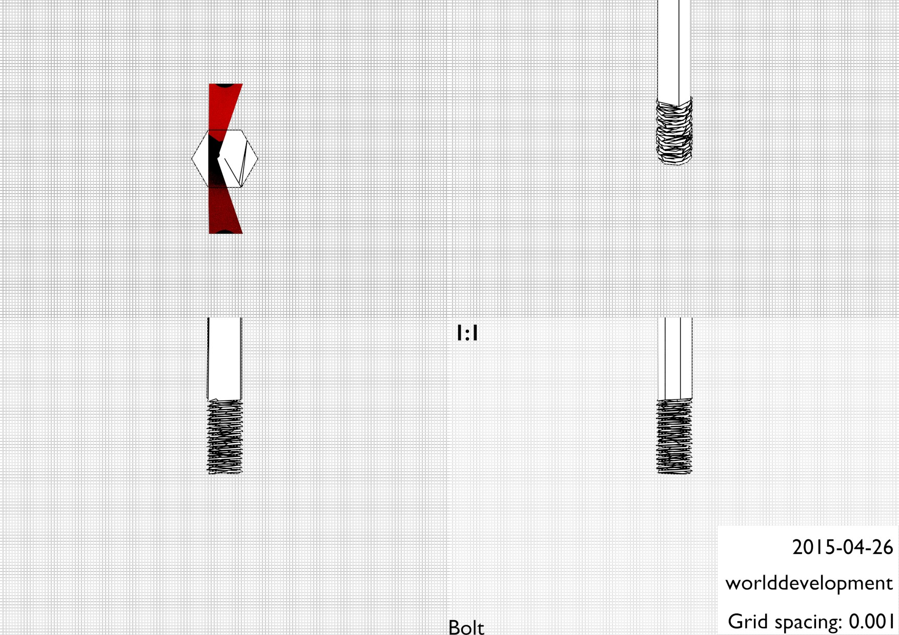</td></tr>
<tr><td colspan="4"></td></tr>
<tr><td>  2x </td><td>	Bolt                                               	</td><td>-        	</td><td>[2.194cm x 1.9cm x 3.592cm]</td></tr>
<tr><td>     	</td><td colspan="3">Bolt</td></tr>
<tr><td>  2x 	</td><td colspan="3">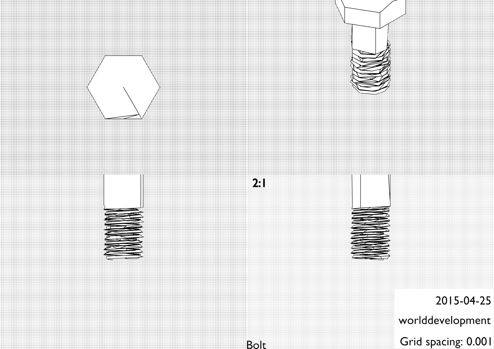</td></tr>
<tr><td colspan="4"></td></tr>
<tr><td> 52x </td><td>	Nut                                                	</td><td>-        	</td><td>[2.194cm x 1.9cm x 1.05cm]</td></tr>
<tr><td>     	</td><td colspan="3">Nut</td></tr>
<tr><td> 52x 	</td><td colspan="3">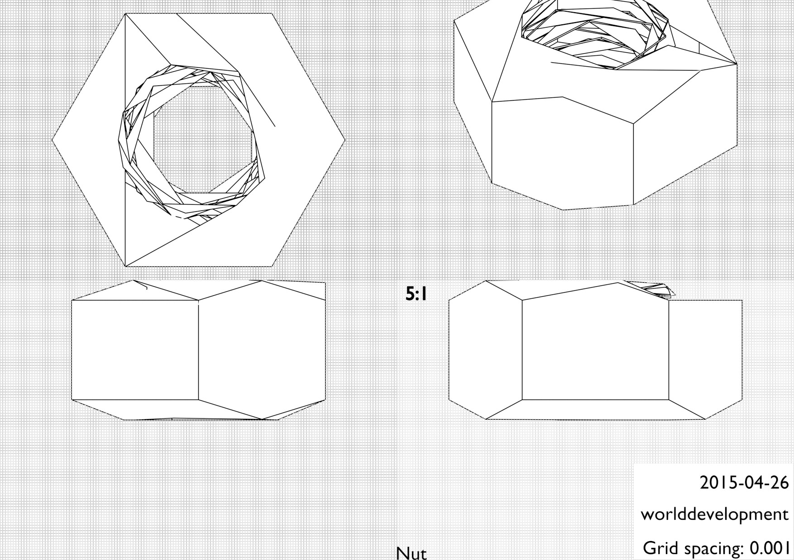</td></tr>
<tr><td colspan="4"></td></tr>
<tr><td>  2x </td><td>	Belt                                        	</td><td>-               	</td><td>[22.0cm x 1.321m x 1.4cm]</td></tr>
<tr><td>     	</td><td colspan="3">1.95m length, depth 22mm, height </td></tr>
<tr><td colspan="4"></td></tr>
<tr><td>  2x </td><td>	Pulley (belt count depends)                                      	</td><td>-                	</td><td>[19.986cm x 19.986cm x 10.0mm]</td></tr>
<tr><td>     	</td><td colspan="3">http://www.hug-technik.com/shop/index.php/cat/c141_SPC-3-rillig</td></tr>
<tr><td>  2x 	</td><td colspan="3">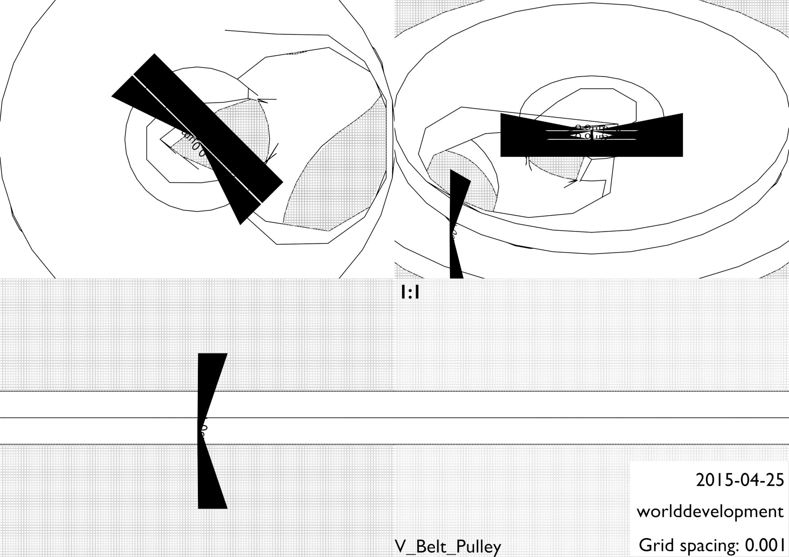</td></tr>
<tr><td colspan="4"></td></tr>
<tr><td>  2x </td><td>	Pulley_Taperlock                            	</td><td>-                 	</td><td>[5.36cm x 5.36cm x 10.0mm]</td></tr>
<tr><td>     	</td><td colspan="3">http://www.hug-technik.com/shop/product_info.php?info=p1876</td></tr>
<tr><td>  2x 	</td><td colspan="3">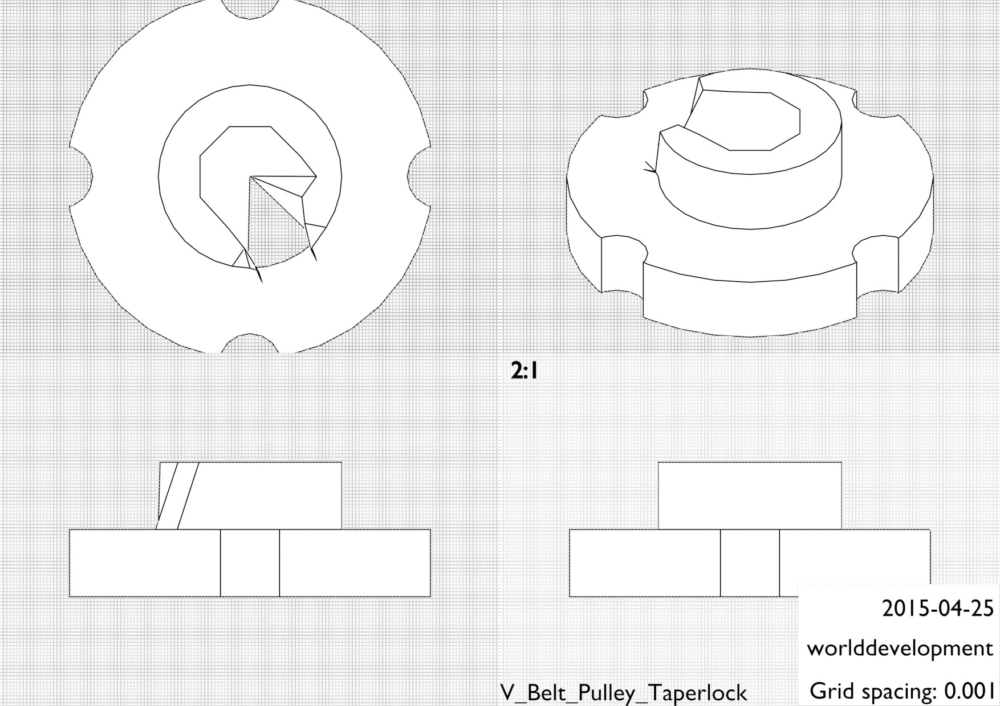</td></tr>
<tr><td colspan="4"></td></tr>

<tr><th colspan="4">Buckets</th></tr>
<tr><td>  2x </td><td>	Sheet                                              	</td><td>-               	</td><td>[7.5cm x 1.7m x 10.0mm]</td></tr>
<tr><td>     	</td><td colspan="3">Cut from wood planks.</td></tr>
<tr><td>  2x 	</td><td colspan="3">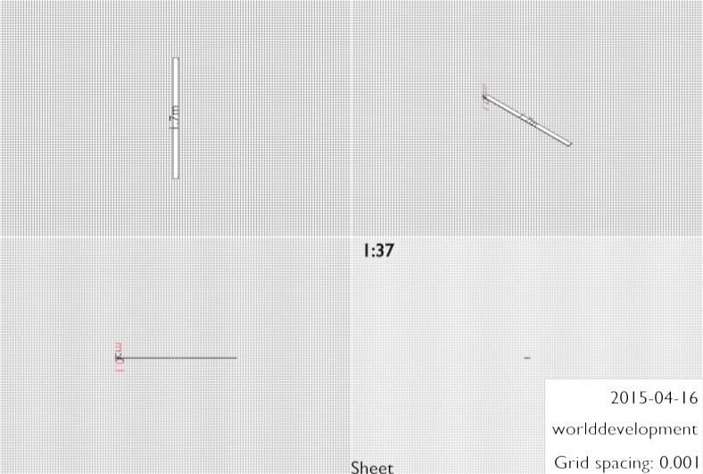</td></tr>
<tr><td colspan="4"></td></tr>
<tr><td> 48x </td><td>	Sheet                                              	</td><td>-                	</td><td>[40.0cm x 30.0cm x 4.0mm]</td></tr>
<tr><td>     	</td><td colspan="3">Cut from wooden planks.</td></tr>
<tr><td> 48x 	</td><td colspan="3">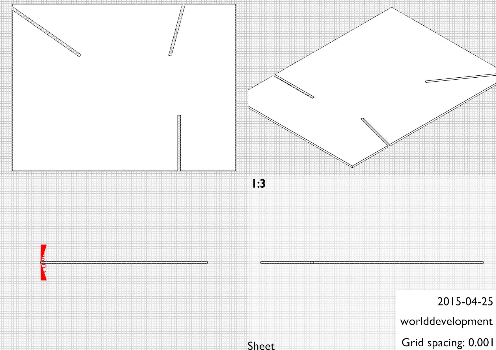</td></tr>
<tr><td colspan="4"></td></tr>
<tr><td> 50x </td><td>	Sheet                                              	</td><td>-      	</td><td>[35.0cm x 4.0mm x 1.0m]</td></tr>
<tr><td>     	</td><td colspan="3">Cut from wooden planks.</td></tr>
<tr><td> 50x 	</td><td colspan="3">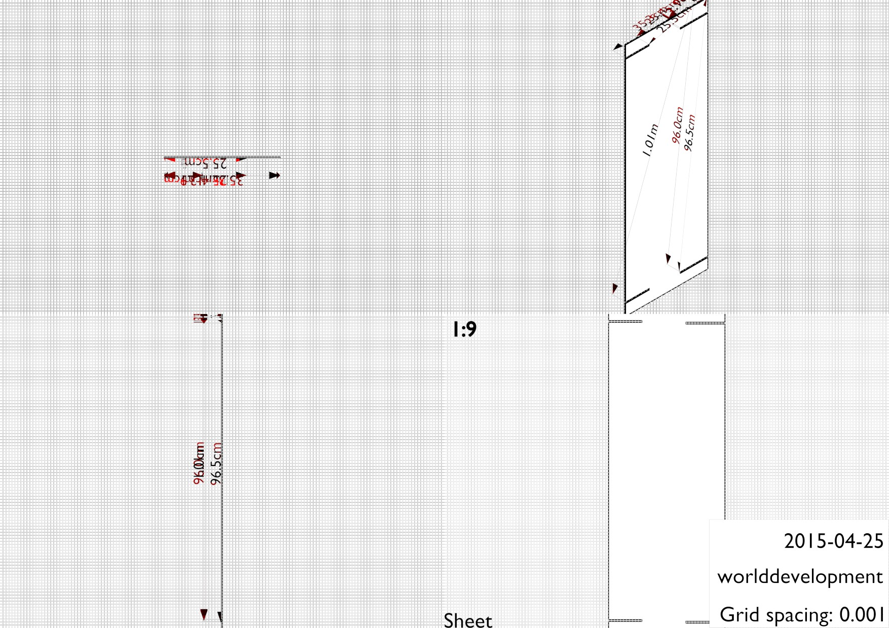</td></tr>
<tr><td colspan="4"></td></tr>
</tbody><tbody></tbody>
