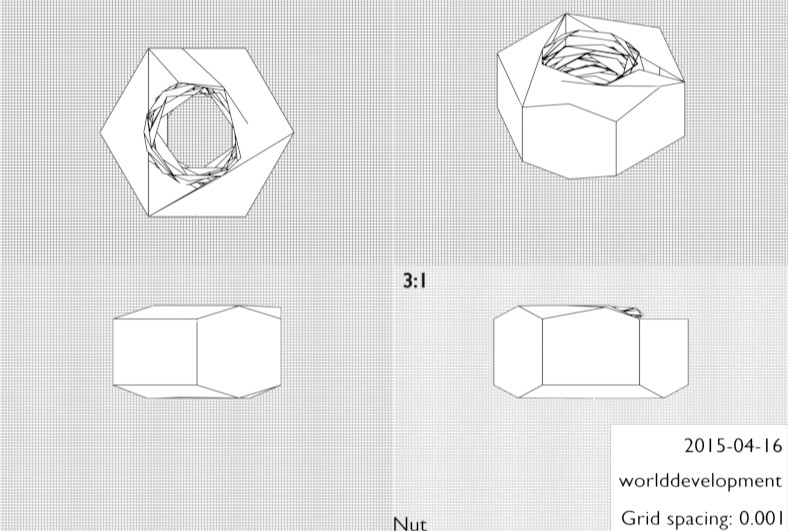
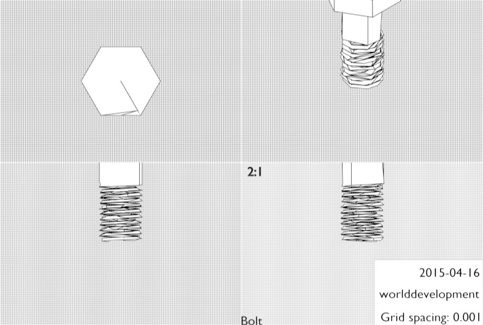
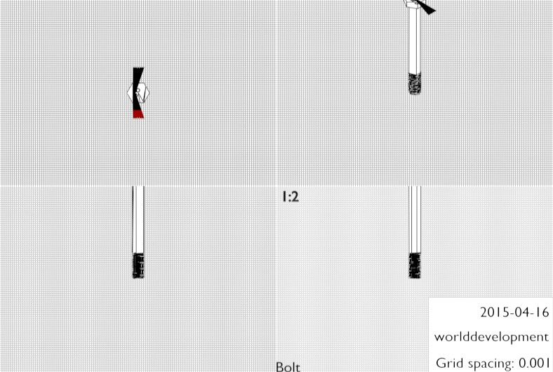
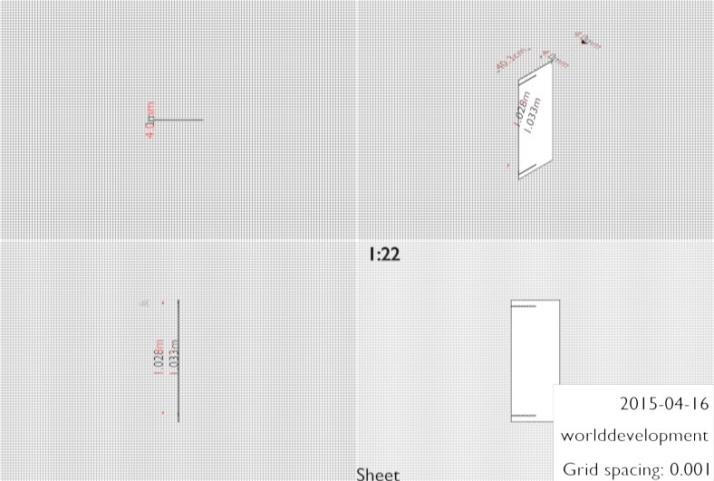
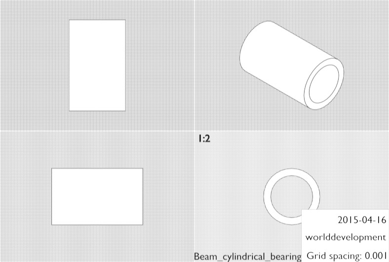
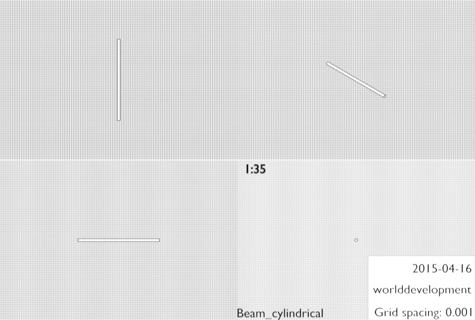
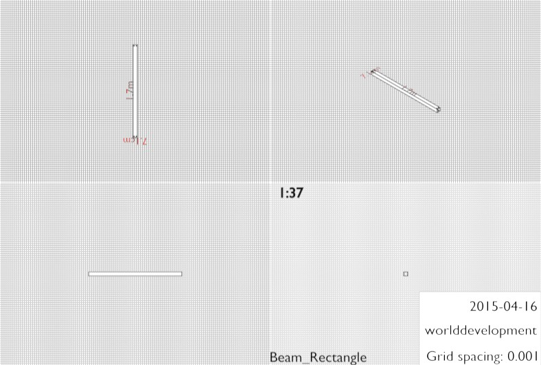
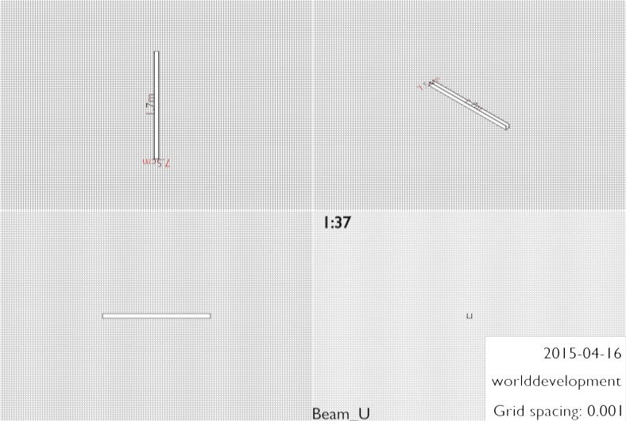

<table><thead>
<tr><th>  #  	</th><th>Label                                              	</th><th>Material      	</th><th>Dimensions</th></tr>
</thead>
<tbody>
<tr><td colspan="4"></td></tr>

<tr><td> 52x 	</td><td>Nut                                                	</td><td>-            	</td><td>[2.194cm x 1.9cm x 1.05cm]</td></tr>
<tr><td> 52x 	</td><td colspan="3"></td></tr>
<tr><td colspan="4"></td></tr>

<tr><td> 2x 	</td><td>Bolt                                               	</td><td>metal            	</td><td>[2.194cm x 1.9cm x 3.592cm]</td></tr>
<tr><td>  2x 	</td><td colspan="3"></td></tr>
<tr><td colspan="4"></td></tr>

<tr><td> 16x 	</td><td>Bolt                                               	</td><td>metal	</td><td>[2.194cm x 1.9cm x 6.842cm]</td></tr>
<tr><td> 16x  	</td><td colspan="3"></td></tr>
<tr><td colspan="4"></td></tr>

<tr><td>  8x 	</td><td>Bolt                                               	</td><td>metal            	</td><td>[2.194cm x 1.9cm x 11.392cm]</td></tr>
<tr><td>  8x 	</td><td colspan="3"></td></tr>
<tr><td colspan="4"></td></tr>

<tr><td colspan="4"></td></tr>
<tr><td colspan="4"></td></tr>
<tr><th colspan="4">Buckets:</th></tr>
<tr><td colspan="4"></td></tr>

<tr><td> 32x 	</td><td>Sheet                                              	</td><td>wood/metal  	</td><td>[40.0cm x 45.0cm x 4.0mm]</td></tr>
<tr><td> 32x 	</td><td colspan="3"></td></tr>
<tr><td colspan="4"></td></tr>

<tr><td> 34x 	</td><td>Sheet                                              	</td><td>wood/metal            	</td><td>[40.0cm x 4.0mm x 1.0m]</td></tr>
<tr><td> 34x 	</td><td colspan="3"></td></tr>
<tr><td colspan="4"></td></tr>

<tr><td colspan="4"></td></tr>
<tr><td colspan="4"></td></tr>
<tr><th colspan="4">Holder:</th></tr>
<tr><td colspan="4"></td></tr>

<tr><td>  2x 	</td><td>Beam_cylindrical_bearing                           	</td><td>copper         	</td><td>[7.75cm x 7.75cm x 12.5cm]</td></tr>
<tr><td>  2x 	</td><td colspan="3"></td></tr>
<tr><td colspan="4"></td></tr>

<tr><td>  1x 	</td><td>Beam_cylindrical                                   	</td><td>metal          	</td><td>[5.706cm x 5.706cm x 1.6m]</td></tr>
<tr><td>  1x 	</td><td colspan="3"></td></tr>
<tr><td colspan="4"></td></tr>

<tr><td> 14x 	</td><td>Beam_Rectangle                                     	</td><td>metal       	</td><td>[7.5cm x 1.7m x 7.5cm]</td></tr>
<tr><td> 14x 	</td><td colspan="3"></td></tr>
<tr><td colspan="4"></td></tr>

<tr><td colspan="4"></td></tr>
<tr><td colspan="4"></td></tr>
<tr><th colspan="4">Stabilizers:</th></tr>
<tr><td colspan="4"></td></tr>

<tr><td>  2x 	</td><td>Sheet                                              	</td><td>metal       	</td><td>[7.5cm x 1.7m x 10.0mm]</td></tr>
<tr><td>  2x 	</td><td colspan="3"></td></tr>
<tr><td colspan="4"></td></tr>

<tr><td>  2x 	</td><td>Beam_U                                             	</td><td>metal       	</td><td>[7.5cm x 1.7m x 7.5cm]</td></tr>
<tr><td>  2x 	</td><td colspan="3"></td></tr>
<tr><td colspan="4"></td></tr>

</tbody>
</table>
