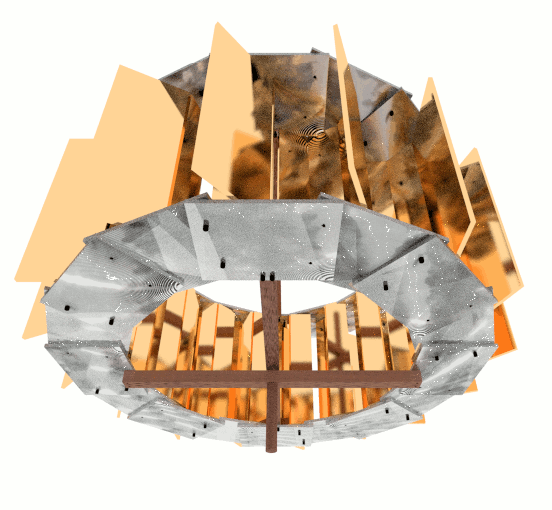

Energy through (water) flow.
===
A low head, low flow, energy harvesting machine.

Design
---
### Mechanic

* The materials are chosen arbitrarily. Whatever you have available. The heavier the material the more problematic the bearings and middle axis will become.
* The design is following the building blocks principle.
* The axle with bearings (ball or slide) and mount are missing.
* Environment will be modeled when the prototype is built to validate the design (as soon as I get the metal, probably steel, either zinc-coated, rust-protection-painted of stainless steel if it can be afforded. The prototype might not be worth it.).
* Prefer overflow over underflow waterwheel. Power efficiency c_p will rise significantly if you surrect an aquaduct/penstock and divert some water of the stream. The water height energy will be captured by the buckets, it's not optimal design but often simplicity wins (consider the energy lost in vibrations if a sophisticated pelton system is integrated, though that might be interesting to evaluate).
The underflow is purely kinetic, while overflow (pitch-back) uses the kinetic energy twice - and the height of the water too.

#### Stress analysis
A stress analysis for common materials: wood, plexiglas, cheap plastic, metal (steel), aluminium.

### Electric
* Asynchronous Induction Motor (one of the most widespread kinds of motor).
* Driven as generator (1..6% over synchronous rotations per minute rating).
* Grid-tied => no self-excitation (capacitors) or controller needed.
* Attached to the axle depending on the generator type: If low Kv/RPM, then the transmission ratio can be decreased, potentially decreasing losses. For common induction motors as generator the transmission ratio will be quite big for run-of-the-stream systems.

Generator 3phase -> 1phase: If the way from the stream to the electric loads is long, consider using the 3 phase machine as 1 phase (which will double line-to-line voltage, info is in the web). This way one transformer only at the consumer side is enough. The loss formulas will be integrated in the open ecological engineering document when we have time. Then it's easier to see when it's worth it and when not. Best is to not at all use transformers (if losses are low enough due to short connection or multiple wires soldered together -- in AC, thick wires won't help due to skin effect!).

Off-grid systems may prefer using permanent magnet generators. Otherwise self-excitation capacitors need installation across the generator windings. A controller will be necessary in off-grid systems if the power source (flow of water) or the load power demand vary a lot. Otherwise voltage and rotation of the motor will change, thus the induction generator may lose more and more torque. Excitation current frequency must be increased, or a load controller be used to stabilize voltage and generator rpm.

There is an ELC design in the works. The situation currently just not allows to further develop it. It's not a lost case, yet, but as here we have grid-tied connection, it's a lot easier, as reactive power can be drawn from the giant (~infinite) electrical grid. Probably a basic ELC will be installed nevertheless. Though it'll not be the PWM one, that is in development. The chokes alone cost hundreds, it's not worth it for low power (pico) systems like this project (about 100..1000W)!

Prototype
---
(missing)

Why a waterwheel design?
---

Initially a turbine was planned. Turns out there is neither enough water flow (high-throughput turbine, Kaplan, Francis), nor enough height difference (for a pressure/impulse turbine).

An archimedian screw does work. Its construction so far has failed.

A cross-flow (universal turbine, often used as wind turbines, exist as drag and/or lift variants) was the turbine of choice until it turned out that power harvest was low despite the water hitting the turbine blades twice.

While the theoretical maximum is 58% (Betz-Limit), it turns out the efficiency will be no higher than 30%. And that's already quite optimistic, it'll rather be <20% if custom-built.
There also is just not enough water in the stream to drive it efficiently (cross-flow need flow!).

They do extract some of the direct height energy of water too (overshot cross-flow), but it's not significant.
 

A helix might have improved the overall sitation. It's just not possible to manufacture it (so far).

Therefore the last hope lay in a waterwheel. Turns out it does have a chance to extract up to 80% of the energy of the water if the design is lucky.

Goals
---

* A green, ecological world. Environment friendly.
* Improve living standard of the world. => Less pain. Terrorists also might have a potentially more difficult life recruiting poor people if they know we care for them (open technology, for a better world).

