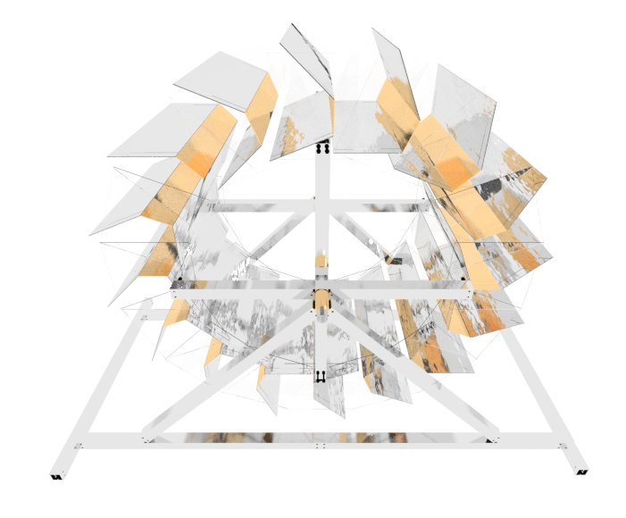

Energy through (water) flow.
===
A low head, low flow, energy harvesting machine.

Design
---
### Mechanic

#### Stress analysis

### Electric
* Asynchronous Induction Motor (one of the most widespread kinds of motor).
* Driven as generator (1..6% over synchronous rotations per minute rating).

* Grid-tied => no self-excitation (capacitors) or controller needed.

Prototype
---
(missing)

Why a waterwheel design?
---

Initially a turbine was planned. Turns out there is neither enough water flow (high-throughput turbine, Kaplan, Francis), nor enough height difference (for a pressure/impulse turbine).

An archimedian screw does work. Its construction so far has failed.

A cross-flow (universal turbine, often used as wind turbines, exist as drag and/or lift variants) was the turbine of choice until it turned out that power harvest was low despite the water hitting the turbine blades twice.

While the theoretical maximum is 58% (Betz-Limit), it turns out the efficiency will be no higher than 30%. And that's already quite optimistic, it'll rather be <20% if custom-built.
There also is just not enough water in the stream to drive it efficiently (cross-flow need flow!).

They do extract some of the direct height energy of water too (overshot cross-flow), but it's not significant.
 

A helix might have improved the overall sitation. It's just not possible to manufacture it (so far).

Therefore the last hope lay in a waterwheel. Turns out it does have a chance to extract up to 80% of the energy of the water if the design is lucky.

Goals
---

* A green, ecological world. Environment friendly.
* Improve living standard of the world. => Less pain. Terrorists also might have a potentially more difficult life recruiting poor people if they know we care for them (open technology, for a better world).

